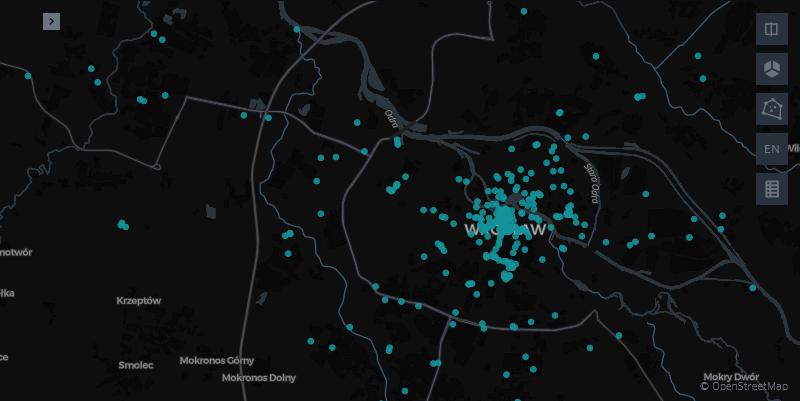

# Wrocław Urban Mobility Pipeline

An ETL pipeline built with Apache Airflow: OpenStreetMap data → PostGIS → interactive map.

The pipeline collects points of interest in Wrocław (Poland), cleans them, reprojects them to a
metric coordinate system, stores them in PostGIS with a spatial index, and renders an interactive
map directly from the database.

## Architecture

    OSM (osmnx) → Airflow DAG → GeoPandas / Shapely → PostgreSQL + PostGIS → Kepler.gl

| Task | What it does |
|---|---|
| `fetch_osm` | Downloads features from OpenStreetMap via osmnx. Retries twice — the Overpass API is not always available. |
| `transform_geo` | Reprojects EPSG:4326 → EPSG:2180, converts building polygons to centroids, drops invalid, unnamed and duplicated records. |
| `load_postgis` | Writes the layer to PostGIS (full refresh), creates a GIST index and runs ANALYZE. |

Tasks pass file paths through XCom rather than the data itself: XCom is stored in the Airflow
metadata database and is not meant for large payloads.

## Stack

- Apache Airflow 3.3.0, LocalExecutor
- PostgreSQL 16 + PostGIS 3.4
- GeoPandas, Shapely, osmnx, GeoAlchemy2
- Kepler.gl / Folium for visualisation
- Docker Compose

## Map

The map is generated from the PostGIS table, not from an intermediate file, so it always reflects
the actual result of a pipeline run.

## Running it

Requirements: Docker with Docker Compose and roughly 4 GB of RAM available to the engine.

Create the `.env` file — it is not part of the repository:

    echo "AIRFLOW_UID=$(id -u)" > .env
    echo "FERNET_KEY=$(docker run --rm apache/airflow:3.3.0 \
      python -c 'from cryptography.fernet import Fernet; print(Fernet.generate_key().decode())')" >> .env
    echo "AIRFLOW__API_AUTH__JWT_SECRET=$(openssl rand -hex 32)" >> .env

Build and start the stack:

    docker compose build
    docker compose up airflow-init
    docker compose up -d

| Service | Address |
|---|---|
| Airflow UI | http://localhost:8080 (`airflow` / `airflow`) |
| PostGIS | `localhost:5433`, database `geo` |

Unpause the `wroclaw_mobility` DAG in the UI and trigger it, or run it from the command line:

    docker compose run --rm airflow-scheduler airflow dags test wroclaw_mobility

Then render the map:

    python3 -m venv .venv
    .venv/bin/python -m pip install -r requirements-dev.txt
    .venv/bin/python viz/make_map.py

## Spatial queries

Data is stored in EPSG:2180 (PUWG 1992), so distances and areas are expressed in metres.

    -- everything within 500 m of a point
    SELECT name
    FROM cafes
    WHERE ST_DWithin(
      geometry,
      ST_Transform(ST_SetSRID(ST_MakePoint(17.03, 51.10), 4326), 2180),
      500
    );

## Design decisions and limitations

- **EPSG:2180 for storage, EPSG:4326 for display.** In a geographic CRS, ST_Area and ST_Distance
  return degrees, which is meaningless for measurements. The data is reprojected once during the
  transform step; the conversion back to WGS84 happens only when the map is rendered.
- **Reprojection happens before centroids are computed.** A centroid calculated in degrees is
  formally incorrect, because a degree of longitude and a degree of latitude cover different
  distances.
- **ST_DWithin instead of ST_Distance(...) < N.** Only the former can use the GIST index.
- **Full refresh instead of incremental loading.** The weekly snapshot is small, and simplicity is
  worth more here than an incremental strategy.
- **A separate metadata database.** Airflow metadata lives in its own PostgreSQL instance, isolated
  from the project data, so resetting Airflow never destroys the geodata.
- **This is a learning project.** Credentials are kept in plain text in `docker-compose.yaml`. In a
  real deployment they would come from Airflow Connections or a secrets backend.

## Project layout

    dags/          Airflow DAG definitions
    viz/           map rendering script
    data/          intermediate files exchanged between tasks (not in git)
    logs/          Airflow logs (not in git)
    docs/          generated map and screenshot